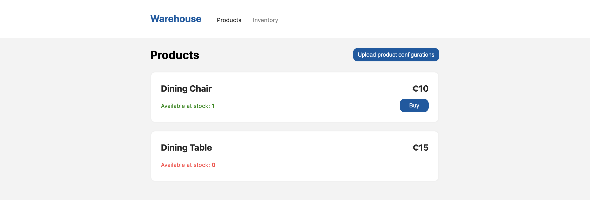

<p align="center">
  
</p>
<h3 align="center">Warehouse app</h3>

---

## 📝 Table of Contents

- [About](#about)
- [Getting Started](#getting_started)
- [Technologies](#technologies)

## 🧐 About <a name = "about"></a>

This repo is made to showcase one of the test assignments that I have done. The
requirements for the assignment are quoted below.

> ## The Task
>
> The assignment is to implement a warehouse software. This software should hold
> articles, and the articles should contain an identification number, a name and
> available stock. It should be possible to load articles into the software from
> a file, see the attached inventory.json. The warehouse software should also
> have products, products are made of different articles. Products should have a
> name, price and a list of articles of which they are made from with a
> quantity. The products should also be loaded from a file, see the attached
> products.json.
>
> The warehouse should have at least the following functionality;
>
> - Get all products and quantity of each that is an available with the current
>   inventory
> - Remove(Sell) a product and update the inventory accordingly

## 🏁 Getting Started <a name = "getting_started"></a>

These instructions will get you a copy of the project up and running on your
local machine for development and testing purposes.

### Install client dependencies

```sh
npm install
```

### Start server and client

This example requires [docker](https://docs.docker.com/get-docker/) to be
installed on your machine.

#### Database

After `docker` installation run this command to make the `mongodb` spinning in a
container:

```sh
docker-compose up -d
```

#### Server

Run this command to make the backend spinning:

```sh
npx nx serve api
```

#### Client

Keep the backend running. Open a new console tab and run this command to make
the frontend spinning:

```sh
npx nx serve warehouse
```

The platform is now available at
[http://localhost:4200/](http://localhost:4200/).

> Feel free to use [inventory.json](assignment/inventory.json) and
> [products.json](assignment/products.json) from the repo in order to upload the
> product configurations and inventory.

## ⛏️ Technologies <a name = "technologies"></a>

- [Nx](https://nx.dev/)
- [Angular](https://angular.io/)
- [TypeScript](https://www.typescriptlang.org/)
- [NestJS](https://nestjs.com/)
- [MongoDB](https://www.mongodb.com/)
- [Mongoose](https://mongoosejs.com/)
- [Jest](https://jestjs.io/)
- [Cypress](https://www.cypress.io/)
